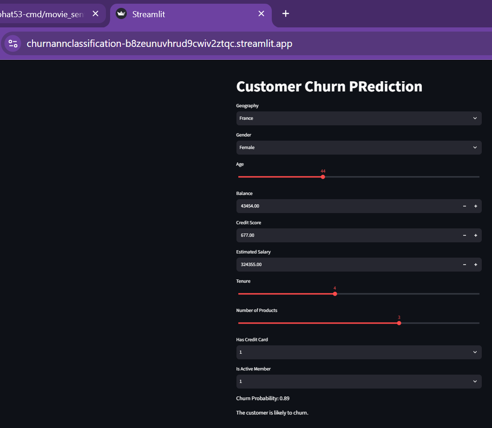

# Customer Churn Prediction — ANN Classification

An end-to-end deep learning project that predicts whether a bank customer will churn (leave the bank), using an Artificial Neural Network (ANN) built with TensorFlow/Keras. The trained model is served through an interactive Streamlit web app. The repo also includes a bonus ANN **regression** model that predicts a customer's estimated salary, and a hyperparameter-tuning notebook exploring different network architectures.

---

## Live Demo

The app is deployed on Streamlit Community Cloud:

🔗 **[https://churnannclassification-b8zeunuvhrud9cwiv2ztqc.streamlit.app/](https://churnannclassification-b8zeunuvhrud9cwiv2ztqc.streamlit.app/)**



> **Note:** Streamlit Community Cloud puts inactive apps to sleep. If the link shows a "waking up" screen, give it a few seconds to spin back up.

---

## Table of Contents

- [Live Demo](#live-demo)
- [Overview](#overview)
- [Architecture](#architecture)
- [Project Structure](#project-structure)
- [Tech Stack](#tech-stack)
- [Dataset](#dataset)
- [Notebooks](#notebooks)
  - [1. `experiments.ipynb` — Churn Classification](#1-experimentsipynb--churn-classification)
  - [2. `prediction.ipynb` — Inference Sanity Check](#2-predictionipynb--inference-sanity-check)
  - [3. `hyperparametertuningann.ipynb` — Hyperparameter Tuning](#3-hyperparametertuningannipynb--hyperparameter-tuning)
  - [4. `salaryregression.ipynb` — Bonus: Salary Regression](#4-salaryregressionipynb--bonus-salary-regression)
- [Setup & Installation](#setup--installation)
- [Usage](#usage)
  - [Running the Notebooks](#running-the-notebooks)
  - [Running the Streamlit App](#running-the-streamlit-app)
- [Model Architecture](#model-architecture)
- [Known Issues / TODO](#known-issues--todo)
- [Future Improvements](#future-improvements)
- [Author](#author)

---

## Overview

Given a bank customer's profile — credit score, geography, gender, age, tenure, balance, number of products, credit card ownership, active-member status, and estimated salary — the model predicts the probability that the customer will **exit (churn)**. The full pipeline covers:

1. Preprocessing the raw dataset (encoding categoricals, scaling numerics)
2. Training a feed-forward ANN classifier with early stopping and TensorBoard logging
3. Saving the trained model and preprocessing objects (encoders/scaler) for reuse
4. Serving predictions through a Streamlit form

A parallel, smaller effort (`salaryregression.ipynb`) repurposes the same dataset to instead predict `EstimatedSalary` as a regression target using a similarly-structured ANN.

---

## Architecture

```
Churn_Modelling.csv (raw dataset, 10,000 rows)
        │
        ▼
 ┌─────────────────────────┐
 │      Preprocessing        │  → drop ID columns, LabelEncode Gender,
 │  (experiments.ipynb)      │    OneHotEncode Geography, StandardScale features
 └─────────────────────────┘
        │  saves: label_encoder_gender.pkl, onehot_encoder_geo.pkl, scaler.pkl
        ▼
 ┌─────────────────────────┐
 │     ANN Classifier        │  → Dense(64, relu) → Dense(32, relu) → Dense(1, sigmoid)
 │  (Sequential / Keras)     │    EarlyStopping + TensorBoard callbacks
 └─────────────────────────┘
        │  saves: model.h5
        ▼
 ┌─────────────────────────┐
 │      Streamlit App        │  → loads model.h5 + encoders/scaler,
 │       (app.py)            │    collects user input, outputs churn probability
 └─────────────────────────┘
```

A separate, parallel branch reuses the same preprocessing approach for regression:

```
Churn_Modelling.csv
        │
        ▼
 Preprocessing (salaryregression.ipynb)
        │
        ▼
 ANN Regressor: Dense(64, relu) → Dense(32, relu) → Dense(1, linear)
        │  saves: regression_model.h5
        ▼
 (no dedicated app — inference logic would mirror app.py)
```

---

## Project Structure

```
churn_ann_classification/
├── app.py                          # Streamlit app — loads model.h5 + preprocessing objects, serves predictions
├── requirements.txt                # Python dependencies
├── README.md
│
├── Churn_Modelling.csv              # Source dataset (10,000 rows)
│
├── experiments.ipynb                # Main notebook: preprocessing + ANN classifier training
├── prediction.ipynb                 # Loads saved model/encoders and runs a single sample prediction
├── hyperparametertuningann.ipynb    # GridSearchCV over ANN architecture (neurons/layers/epochs) via scikeras
├── salaryregression.ipynb           # Bonus: ANN regression model predicting EstimatedSalary
│
├── model.h5                         # Trained ANN classifier (churn prediction)
├── regression_model.h5              # Trained ANN regressor (salary prediction)
│
├── label_encoder_gender.pkl         # Fitted LabelEncoder for the Gender column
├── onehot_encoder_geo.pkl           # Fitted OneHotEncoder for Geography — saved by experiments.ipynb; used by app.py
├── one_hot_encoder_geo.pkl          # Encoder artifact from the standalone tuning notebook (not used by app.py)
├── scaler.pkl                       # Fitted StandardScaler for numeric features
│
└── images/
    └── streamlit_deployed.png       # Screenshot of the deployed Streamlit app
```

---

## Tech Stack

| Category | Tools |
|---|---|
| Language | Python |
| Data processing | pandas, numpy |
| ML / preprocessing | scikit-learn (`LabelEncoder`, `OneHotEncoder`, `StandardScaler`, `GridSearchCV`) |
| Deep learning | TensorFlow / Keras (`Sequential`, `Dense`, `EarlyStopping`, `TensorBoard`) |
| Hyperparameter tuning | scikeras (`KerasClassifier` + scikit-learn's `GridSearchCV`) |
| Serialization | pickle (encoders/scaler), Keras `.h5` format (models) |
| Web app | Streamlit |
| Visualization | matplotlib, TensorBoard |

---

## Dataset

`Churn_Modelling.csv` — 10,000 bank customer records with the following columns:

| Column | Type | Description |
|---|---|---|
| `RowNumber`, `CustomerId`, `Surname` | — | Identifiers, dropped before modeling |
| `CreditScore` | numeric | Customer's credit score |
| `Geography` | categorical | Customer's country (France / Germany / Spain) — one-hot encoded |
| `Gender` | categorical | Male / Female — label encoded |
| `Age` | numeric | Customer's age |
| `Tenure` | numeric | Years as a customer |
| `Balance` | numeric | Account balance |
| `NumOfProducts` | numeric | Number of bank products used |
| `HasCrCard` | binary | Whether the customer has a credit card |
| `IsActiveMember` | binary | Whether the customer is an active member |
| `EstimatedSalary` | numeric | Customer's estimated salary — **target** for the bonus regression task |
| `Exited` | binary | **Target** for the main classification task (1 = churned) |

---

## Notebooks

### 1. `experiments.ipynb` — Churn Classification
The main notebook and source of truth for the deployed app:
1. Loads `Churn_Modelling.csv`, drops `RowNumber`, `CustomerId`, `Surname`.
2. `LabelEncoder` on `Gender`; `OneHotEncoder(sparse_output=False)` on `Geography`, concatenated back into the dataframe.
3. Saves `label_encoder_gender.pkl` and `onehot_encoder_geo.pkl`.
4. 80/20 train/test split (`random_state=42`), `StandardScaler` fit on train and applied to test, saved as `scaler.pkl`.
5. Builds a `Sequential` ANN: `Dense(64, relu)` → `Dense(32, relu)` → `Dense(1, sigmoid)`, compiled with `Adam(learning_rate=0.01)` and `BinaryCrossentropy` loss.
6. Trains with `EarlyStopping(monitor='val_loss', patience=16, restore_best_weights=True)` and a `TensorBoard` callback logging to `logs/fit/<timestamp>`.
7. Saves the trained model as `model.h5`.

### 2. `prediction.ipynb` — Inference Sanity Check
Loads the saved `model.h5`, all three preprocessing objects, and runs a single hardcoded example customer through the full preprocessing → prediction flow — effectively a manual test that mirrors what `app.py` does for a single input row.

### 3. `hyperparametertuningann.ipynb` — Hyperparameter Tuning
Wraps the same model-building logic in a `create_model(neurons, layers)` function, uses scikeras's `KerasClassifier` to make it scikit-learn-compatible, and runs `GridSearchCV` over:
```python
param_grid = {
    'neurons': [16, 32, 64, 128],
    'layers':  [1, 2, 3],
    'epochs':  [50, 100]
}
```
with `cv=3` and `n_jobs=-1`, printing the best score and parameter combination found. This notebook is a standalone exploration of the architecture space — it reports the best hyperparameters rather than saving a final `.h5` model, and isn't part of the deployed pipeline.

### 4. `salaryregression.ipynb` — Bonus: Salary Regression
Repeats the same preprocessing pattern, but sets `EstimatedSalary` as the regression target (dropping it from `X` instead of `Exited`). Builds a near-identical ANN — `Dense(64, relu)` → `Dense(32, relu)` → `Dense(1)` (linear output) — compiled with `mean_absolute_error` loss, trained with early stopping + TensorBoard, evaluated on test MAE, and saved as `regression_model.h5`. This is a standalone demonstration of applying the same ANN pattern to a regression target; it isn't served by `app.py`, which is classification-only.

---

## Setup & Installation

### 1. Clone the repository
```bash
git clone <repo-url>
cd <repo-folder>
```

### 2. Create a virtual environment
```bash
python -m venv venv
source venv/bin/activate      # Windows: venv\Scripts\activate
```
(Use `conda create -p venv python==3.10 -y` instead if you prefer conda — TensorFlow/scikeras compatibility is generally easiest on Python 3.9–3.11.)

### 3. Install dependencies
```bash
pip install -r requirements.txt
```

---

## Usage

### Running the Notebooks
```bash
jupyter notebook experiments.ipynb
```
Run `experiments.ipynb` first (produces `model.h5` + the three preprocessing `.pkl` files that `app.py` depends on). `prediction.ipynb`, `hyperparametertuningann.ipynb`, and `salaryregression.ipynb` can be run independently afterward.

To inspect training curves logged during any notebook run:
```bash
tensorboard --logdir logs        # or regressionlogs, for salaryregression.ipynb
```

### Running the Streamlit App
```bash
streamlit run app.py
```
This opens the app in your browser (default `http://localhost:8501`). Fill in the customer's Geography, Gender, Age, Balance, Credit Score, Estimated Salary, Tenure, Number of Products, Has Credit Card, and Is Active Member, then view the predicted churn probability and a plain-language verdict ("likely to churn" / "not likely to churn").

`app.py` loads `model.h5`, `label_encoder_gender.pkl`, `onehot_encoder_geo.pkl`, and `scaler.pkl` — all four must exist in the working directory (i.e. run `experiments.ipynb` at least once first on a fresh clone, since these generated files aren't guaranteed to be tracked/present otherwise).

### Deployment

The app is deployed on **Streamlit Community Cloud**, which builds directly from the GitHub repo — pushing to the tracked branch redeploys automatically. For this to work, `model.h5` and the three `.pkl` preprocessing files must be committed to the repo, since the cloud runtime has no way to run the training notebooks itself. `requirements.txt` drives dependency installation in the hosted environment.

---

## Model Architecture

**Classification (churn) — `model.h5`:**
```
Input (12 features: CreditScore, Gender, Age, Tenure, Balance, NumOfProducts,
       HasCrCard, IsActiveMember, EstimatedSalary, Geography_France/Germany/Spain)
  → Dense(64, activation='relu')
  → Dense(32, activation='relu')
  → Dense(1, activation='sigmoid')

Optimizer: Adam (lr=0.01)
Loss:      Binary Crossentropy
Metric:    Accuracy
Callbacks: EarlyStopping (patience=16, restore_best_weights=True), TensorBoard
```

**Regression (salary) — `regression_model.h5`:**
```
Input (11 features: same as above, minus EstimatedSalary which is now the target)
  → Dense(64, activation='relu')
  → Dense(32, activation='relu')
  → Dense(1)                        # linear activation (default) — regression output

Optimizer: Adam (default)
Loss:      Mean Absolute Error
Metric:    MAE
Callbacks: EarlyStopping (patience=10, restore_best_weights=True), TensorBoard
```

---

## Known Issues / TODO

**By design (not bugs):**

- The `.pkl` files in this repo (`label_encoder_gender.pkl`, `onehot_encoder_geo.pkl`, `scaler.pkl`) belong to the **classification** pipeline only — these are what `experiments.ipynb` produces and what `app.py` loads. `salaryregression.ipynb` and `hyperparametertuningann.ipynb` are standalone exploratory notebooks, not part of the deployed path, so their preprocessing artifacts aren't wired into the app and any encoder/scaler files they write are incidental.
- `hyperparametertuningann.ipynb` intentionally reports the best hyperparameter combination rather than saving a final `.h5` model — it's an exploration of the architecture space, not a model-producing step.
- `regression_model.h5` is a bonus artifact demonstrating the same ANN pattern applied to a regression target. It has no serving counterpart in `app.py`, which is classification-only.

**Open:**

- [ ] **No evaluation metrics beyond training accuracy/loss are shown** for the classifier in `experiments.ipynb` (e.g. no confusion matrix, precision/recall, or ROC-AUC on the held-out test set) — useful additions given churn prediction is often evaluated on more than raw accuracy (class imbalance is common in churn datasets).

---

## Future Improvements

- **Class imbalance handling** — check the `Exited` class balance and consider techniques like class weighting or resampling if churners are a minority class, which is typical for churn datasets.
- **Model comparison** — compare the ANN against simpler baselines (logistic regression, gradient boosting) to confirm the added complexity of a neural network is actually paying off on this tabular dataset.
- **Unified preprocessing artifact** — if the regression or tuned models ever become part of the deployed path, consolidate preprocessing into one shared module so every model references the same encoders/scaler.
- **Serve the regression model too** — extend `app.py` (or add a second page) so the salary-prediction model is also user-facing, which would mean saving a matching set of preprocessing artifacts for the regression feature set.
- **Containerize** — add a Dockerfile for reproducible local runs and to keep the option open of deploying elsewhere (e.g. AWS Elastic Beanstalk / EC2) alongside the existing Streamlit Cloud deployment.

---

## Author

**Shivangi**
📧 shivangibhat53@gmail.com